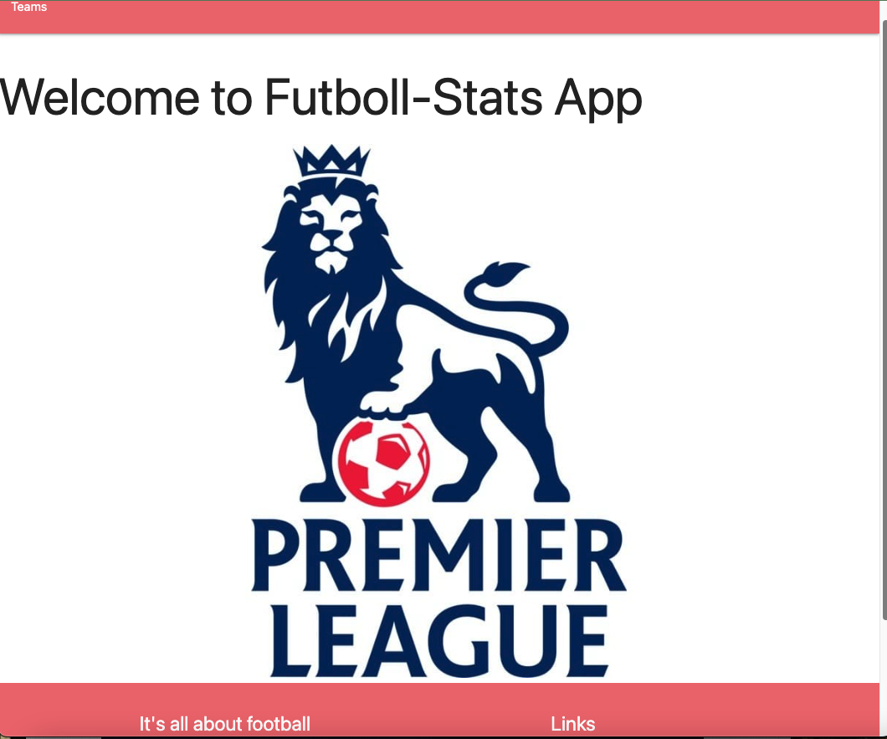

# Futboll-Stats
A webb app for English football fans! Here you can find stats about your favourite team. You can also add, remove or edit your favourite team. 

## Technologies
- Express.js
- Node.js
- JavaScript
- MongoDB
- Mongoose
- EJS
- Postman
- CSS3
<<<<<<< HEAD

### Wireframes
![Screenshot]

### Planing
Trello

=======

### Planing
Trello
>>>>>>> 5fd40fcc30af9e6da773f040e879cd184f164d72

## Features
- User can search through a database to see stats about Football Teams in English Premier League
- User can Add, Edit and Delete teams.

## Design
- Design elements implemented using CSS3

### Images of Working App
Home page:
<<<<<<< HEAD

![Screenshot]
=======

>>>>>>> 5fd40fcc30af9e6da773f040e879cd184f164d72

### Getting Started
 to see the working app

## Future Enhancements
<<<<<<< HEAD
- Implementing a better style and design for a higher quality UI/UX.
=======
>>>>>>> 5fd40fcc30af9e6da773f040e879cd184f164d72
